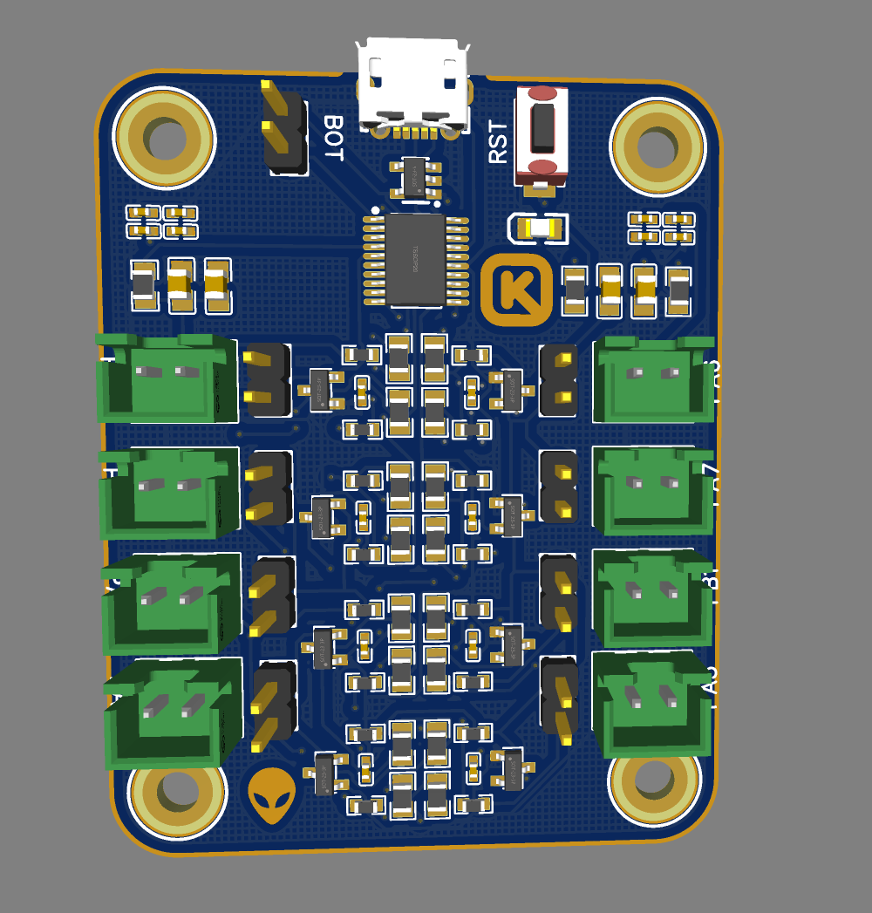
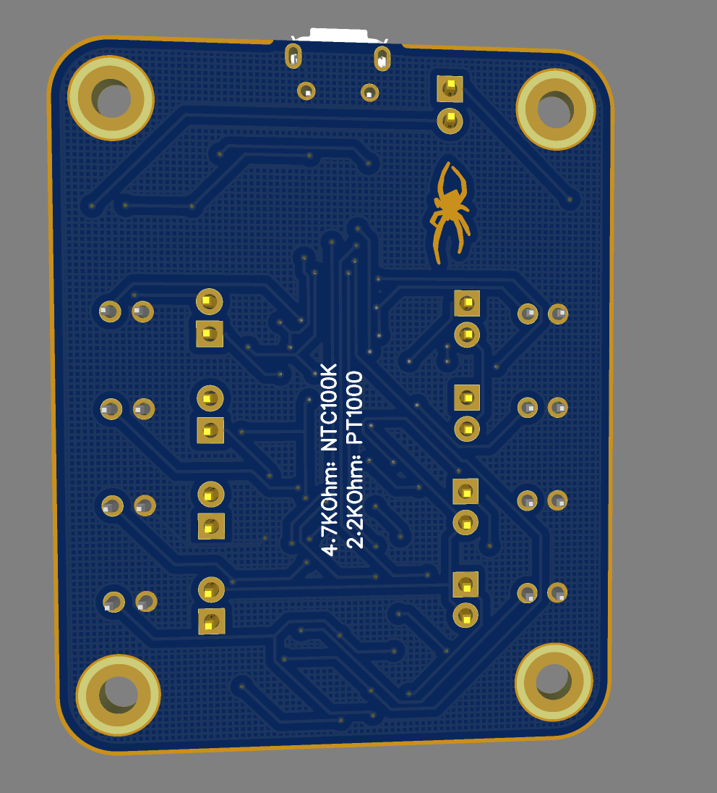
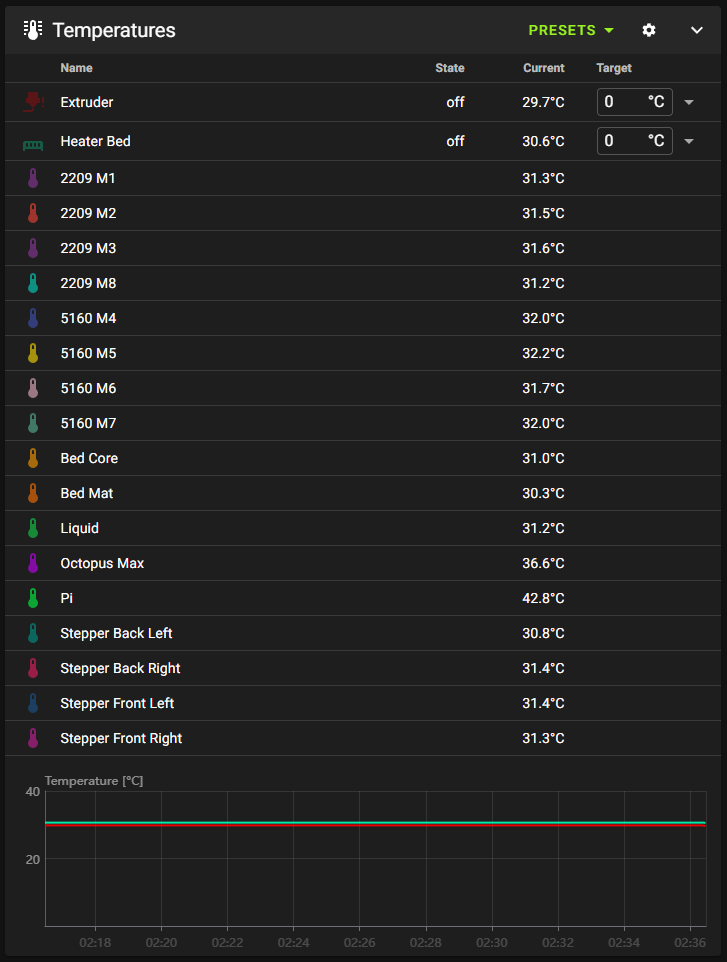

# Thermistor Expansion PCB

Welcome to the Thermistor Expansion PCB project! This custom PCB is designed to expand the number of thermistors in your printer, supporting up to 8 NTC100k or PT1000 thermistors. You can mix and match different types to suit your needs. 

## Features

- Supports up to 8 NTC100k or PT1000 thermistors
- Mix and match different thermistor types
- Manual flashing required (no auto-flashing with Ratos)
- Compact and efficient design

## Project Background

I created this project because the current commercial options didn't meet my needs. This PCB allows for greater flexibility and customization in managing multiple thermistors for your printer. 

## How to Get Involved

If you’re interested in this project or have specific features you’d like to see in the next version, please let me know! Your feedback is crucial to help improve this project.

## Commercial Alternative

If you are looking for a commercial alternative, check out [Therm2 by Not Salmon Man](https://provok3d.com/product/therm2-by-not-salmon-man%E0%B6%9E/?v=0b98720dcb2c). It's a great option worth considering.

## Contact

Currenlty working on a new version with multiple integrated MAX amplifiers and support for more thermistors. For updates join the discord: https://discord.gg/GEyaRTchyN

  <strong><h1>Other projects from the autor (me)</h1></strong>

3D models / Prints:
 - [Mason jar ashtray](https://www.printables.com/model/918749-ashtray-mason-jar)
A mason jar attachment to make almost every jar in to an ashtray.

Printer mods:
 - [Servo nozzle brush (printables).](https://www.printables.com/model/913748-ratrig-vcore-331-servo-nozzle-brush)
A servo attached nozzle brush.
 - [Servo nozzle brush (github).](https://github.com/keyquesttech/Ratrig-Vcore-3-3.1-servo-nozzle-brush)
A servo attached nozzle brush.
 - [Endstops.](https://github.com/keyquesttech/3d_printer_endstops)
A collection of custom endstops for 3d printers or cnc machines. 
 - [Thermexp.](https://github.com/keyquesttech/Thermexp)
A PCB to add more thermistors to a klipper printer.

Chrome extensions:
 - [Youtube ads auto skip.](https://github.com/keyquesttech/chrome-extensions)
A chrome extension that emulates a click and auto skips youtube ads. Works even after adblock prevention measures.

Keyboards:
 - [Enclave.](https://github.com/keyquesttech/Enclave)
A custom mechanical switch macro pad. Works on QMK and can be used with klipper.
